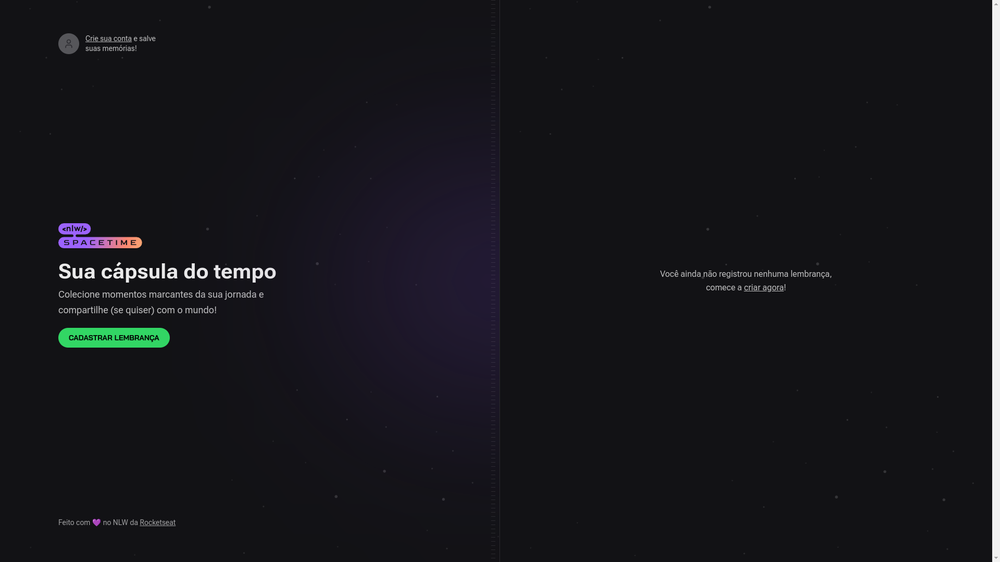
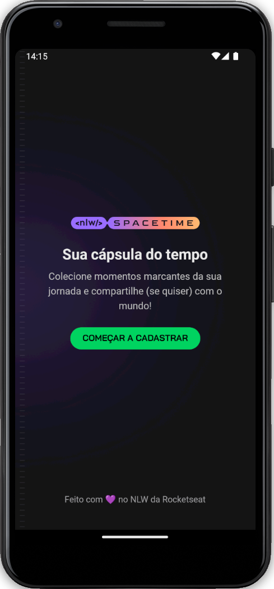

<div align="center">
  
</div>
<br/><br/><br/>

# NLW Spacetime
<br/>

Projeto desenvolvido durante o evento NLW Spacetime realizado pela <a href="https://www.rocketseat.com.br/ ">Rocketseat</a>.
<br/><br/>

## 🛠️ Tecnologias

Esse projeto foi desenvolvido com as seguintes tecnologias:

* [Next.js](https://nextjs.org/) - Usado no app web
* [Node.js](https://nodejs.org/en) - Usado no backend
* [Expo](https://expo.dev/) - Usado no app mobile

<br/>

## 🚀 Começando

Essas instruções, permitirão que você obtenha uma cópia do projeto em operação na sua máquina local. Para fins de desenvolvimento e teste.
<br/><br/><br/>

### 📋 Pré-requisitos

Ter o Noje.js instalado em seu computador, para poder instalar as dependências do projeto.
<br/><br/><br/>

### 🔧 Instalação

Abra o terminal na pasta de cada projeto (web, backend e mobile), rode o comando

```
npm i
```
Após executar o comando, aguarde instalar todas as dependências.
<br/><br/><br/>

### ⚙️ Configuração

Criar o arquivo .env na raiz do projeto backend, para configurar as variáveis ambiente *GITHUB_CLIENT_ID* e *GITHUB_CLIENT_SECRET*. Tanto do app web, quanto do app mobile.<br/>
Criar o arquivo .env.local do projeto web, para configurar a variável de ambiente *NEXT_PUBLIC_GITHUB_CLIENT_ID*.
<br/><br/><br/>

---
⌨️ com ❤️ por [Developer Fabio](https://gist.github.com/developerfabio) 😊
